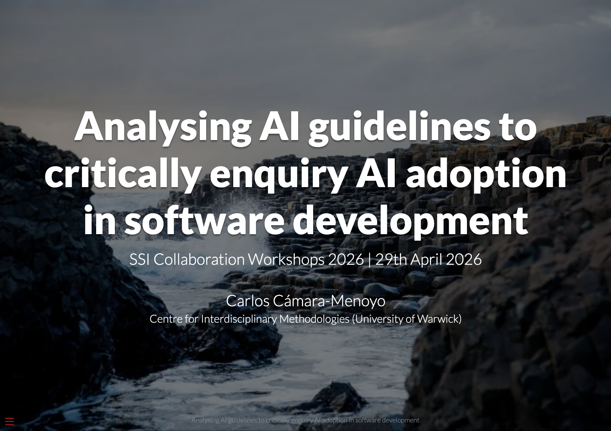

## **Analysing AI guidelines to critically enquiry AI adoption in software development**

**Day and time:** Wednesday 29 April, 15:00 - 16:00

### **Abstract:**

> AI is profoundly transforming many facets of our lives, one of them being how we think about and develop software. Specialised LLMs, IDE integrations, a myriad of services and platforms, as well as the emergence of new development methods (e.g. vive coding) all of which promise speed and efficiency, have led to a massive adoption in corporate environments. This shift has also permeated to HE organisations who are also embracing AI to develop research software (as well as for teaching and researching) even though they collide with their core values and principles such as scientific knowledge, academic integrity, inclusion and diversity, collaboration or committing to producing a positive impact beyond academia, usually related with sustainability or social justice.
>
> This workshop will be the kick-off of my SSI Fellowship aimed at Creating CriticAI, a community of practice to critically enquiry about AI’s adoption in HE and influence in the decision-making processes to ensure that AI usage is aligned with academia’s ethos. In the first half of this session, participants will be analysing universities’ guidelines to produce a collaborative mapping of AI’s adoption across HE. This will inform a discussion on the second half of the session, where we will collaboratively be exploring the challenges, tensions and contradictions that AI is introducing in our jobs and workplaces.
>
> Those attending to the workshop are expected to meet and engage with a group like-minded software developers who want to and gain a renewed critical awareness of AI adoption that probably (and hopefully) can lead to form a community of practice and collective action.

### Slides

(to be added after the workshop)

### Policies and Collaborative notes

(to be added after the workshop)