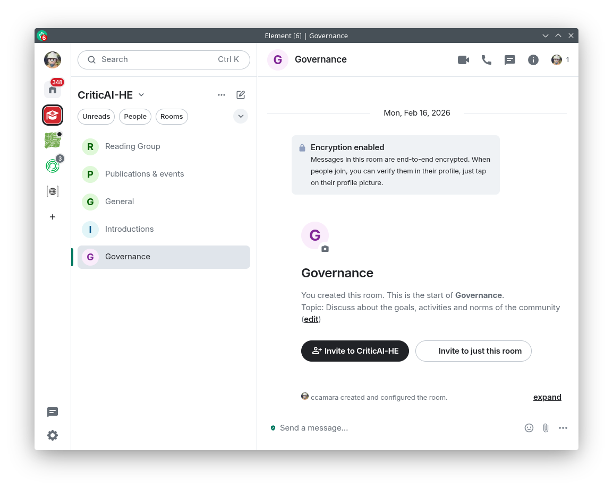

## Aims {.center}

-   Introduce you to CritiCAI

    -   Progress being made (and not made!)

    -   Explain

-   Get feedback

-   Sense checking / validation

::: callout-important
## AI warning

No AI whatsoever was used in the creation of this presentation or their supporting materials.
:::

# What I said in my application {.smaller}

> I will be building **CriticAI**, a community of practice to critically enquiry about AI’s adoption in HE and influence in the decision-making processes to ensure that AI usage is aligned with academia’s ethos.

:::: {.columns}

::: {.column width="45%"}
Aims:

1.  Meet and connect with people sharing similar concerns/approaches about AI in HE
2.  Share knowledge, experiences and resources about AI in HE
3.  Do something together (collective action)
4.  Influence decision-making processes in HE in relation to AI usage
5.  Have fun!
:::

::: {.column width="45%"}
- Are you concerned with the way AI is being implemented in HE?
- Do you feel isolated when you flag your concerns about how AI can impact our work (e.g. how we research and teach), how students learn, or the future of universities?
- Do you want your voice made heard?
- Do you want to work together with others to influence decision-making processes in HE in relation to AI usage?

:::

::::

# What I've done so far...

##  {#logo .center data-menu-title="A logo!"}

First things, first... a logo!

{width="600"}

##  {#video .center data-menu-title="A video"}

{fig-align="center"}

## A \[matrix\] space

{fig-align="center"}

## GitHub Organisation

](media/github-organisation.png){fig-align="center"}

## First planned activity!

[**SSI CW2026 workshop: Analysing AI guidelines to critically enquiry AI adoption in software development.**](https://docs.google.com/document/d/11Vflm_hk8zF4SksKcS21q9WGnZZCvBXrpNp8wJgYPNo/edit?tab=t.0)

Participants will bring policies and discuss them: what they say and what is missing from them.

-   Attend to the workshop and bring your own policies

-   If someone wants to help with organisation, please do reach out

## The infrastructure is (almost) ready, but...

-   I have not told anyone about the community yet.
-   Website is empty
    -   No info about community's aims, activities, or how to join.
-   No messages in the Matrix space or the GitHub organisation.
-   Zero members!

# Analysis paralysis! {background-image="https://i.giphy.com/eImrJKnOmuBDmqXNUj.webp" background-color="#000"}

I'm stuck! Support is welcome!

## This is what I keep asking myself...

:::: {.columns}

::: {.column width="45%"}
-   What kind of community do I want to build?
    -   Support group? (therapy)
    -   Union (collective action and bargaining power)
    -   Social (networking and sharing)
    -   Learning (knowledge sharing and skill development)
    -   Something else?

:::

::: {.column width="45%"}
-   Where to start?
    -  Unconf may be too big and intimidating for a first activity
    -  Reading group?
    -  Survey?
    -  ...?
-   Who is the community for?
    -   Academics? RSEs? Just from the UK?
-   What's the community's stance on AI?

:::

::::

## Me &/vs. Community

- Bottom up vs top down: 
  - As a firm believer on open 
  - I have a very oppinionated stance on AI (and more broadly, on the tools I do not like using), but not sure how much of this needs to be pushed
- Tools: 
  -  Important to be coherent (e.g. rejecting AI-fueled solutions), but also, is this the battle I want to pick? (AI is overwhelming enough!)

## Commit Often, Perfect Later {.center}

Thanks to Oscar and Yo for their mentoring and guidance!

## Hello world!

Hi, my name is Carlos and I am building CriticAI. Nothing big at the moment, but if any of the following questions resonate with you, please do reach out!

- Are you concerned with the way AI is being implemented in HE?
- Do you feel isolated when you flag your concerns about how AI can impact our work (e.g. how we research and teach), how students learn, or the future of universities?
- Do you want your voice made heard?
- Do you want to work together with others to influence decision-making processes in HE in relation to AI usage?

We will be meeting on [DATE]{.highlight-text} at TIME at PLACE to have an initial chat on what is concerning you

## Questions for you {background-color="#D2232A"}

1. What is concerning you about AI in HE?
2. Does any of this sound appealing to you? Would you like to be involved in this community?
3. Do you have any suggestions on:
    - How/where to start? 
    - What kind of activities would you like to do? 
    - What tools would you like to use?
    - ...
